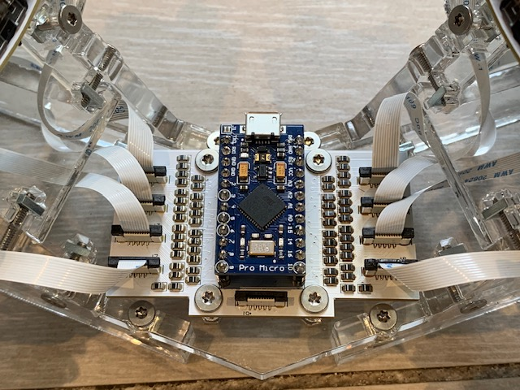

# Gull

**NOTE:** These images are from Gull V1. V2 is quite similar, but the thumb cluster attaches to the rib rather than being a part of it.

Gull is a dished ergonomic keyboard. It contains no 3D-printed parts and no hand-wired circuitry, and is designed for rapid constructibility rather than aesthetics. Keys are inserted into thin FR4 PCBs which are bent to the frame.

The raison d'etre of Gull is to be rapidly assembled, tweaked, and remade. The frame is fully parameterized, and changing a parameter generally only requires recutting one shape. PCBs can be reused after changing almost any parameters. The exposed ribbon cables make it potentially impractical for portable use.

The key layout is essentially 3x6 on each side. There are six additional keys per side, two in the bottom center of each side and four (relatively inaccessible) keys at the top corners of each side.

PCB layout is in KiCad. Frame shapes are in OpenSCAD. The firmware is QMK; the fork is available at https://github.com/Sneftel/qmk_firmware/tree/gull , and will be PR'd back when I get some time to clean it up.

## Tools

The frame for Gull must be cut from acrylic or similar using a laser cutter.

The PCBs have surface-mount components. A hotplate is the best tool for soldering these, but hand soldering is also possible. Hot air reflow can be used but be aware of temperature limits for the FFC connectors.

## Materials

I use six millimeter-thick acrylic for the frame. Eight millimeter will also work. Below six millimeters is not recommended. Plywood will likely also be acceptable, though I have not tested the most recent shapes with plywood.

The finger and thumb PCBs should be fabricated from 0.8mm-thick FR4. I have not tested other materials or thicknesses. The center PCB should be fabricated from thicker FR4 (I use standard 1.6mm-thick FR4).

## Parts

The following parts are required:

### Hardware 

* 38 14mm-long M3 bolts (not countersunk)
* 26 10mm-long M3 bolts (not countersunk)
* 56 6mm M3 square nuts
* 4 4mm female-threaded hex spacers
* 2 15mm female-threaded hex spacers for each bending clamp (optional, discussed below)
* 4 M3 hex nuts

### Components

* 56 Kailh Choc V1 low-profile keyswitches
* 56 Choc V1 keycaps
* 56 0805 diodes
* 16 vertical FFC connectors, 10 pin, 0.5mm pitch
* 8 FFC ribbon cables in various lengths from 10cm to 25cm, 10pin, 0.5mm pitch, type B (opposite side contacts)
* Pins and sockets for a Pro Micro MCU
* Pro Micro MCU (or pinout-compatible)

### Laser-cut pieces

* 6 ribs, 2 for each position
* 4 spines
* 2 thumb cluster necks
* 2 thumb cluster bodies
* 12 stabilizers
* 1 pelvis
* 2 bending clamps for each distinct rib radius (optional, discussed below)

### PCBs

* 6 fingerboards, in 0.8mm FR4
* 2 thumbboards, in 0.8mm FR4
* 1 centerboard, in 1.6mm FR4 or similar

## Customization

### Basic development

Most customization should be done through frame/params.scad. This file contains almost all parameters one might want to tweak, and documents which pieces are affected by which parameters. 

To visualize the keyboard as a whole, open frame/main.scad. This file should not be used to generate shapes for laser cutting.

### Dilation

The OpenSCAD files dilate some parts to account for the laser cutter's kerf. If your cutter's control software includes this as a feature, you should either disable it in the control software, or disable the dilation by setting the KERF parameter in params.scad to 0. Otherwise, cut a 10mm square, measure the average of its side lengths and subtract that from 10, and set KERF to that value. If the kerf is above 0.6 or so, you may have trouble getting things to fit firmly.

### Customizing the T-slots

For easy assembly, it's useful for the square nuts to firmly friction-fit into the T-slots. This requires a fairly tight tolerance. The "tnuttester.scad" file can be used to empirically determine the right parameters for this, given a particular laser cutter and material. See the comments in that file for how to use it.

### Customizing the bending clamp

If you have customized the rib radii, you will need to customize the bending clamp radius to match (the parameter BEND_RADIUS in clamp.scad), and you will need to fabricate separate clamp shapes for each distinct rib radius. 

## Fabrication

### PCBs

The fingerboards and centerboard may be panelized or printed as-is. To build Gerber files which should be acceptable at most fabs (I use Elecrow), run makeall.bat or "make" in the board directory.

The thumbboard has delicately narrow areas and should be carefully panelized for fabrication. I use KiKit for this, with "panelize.json" containing the necessary presets. The auto-built Gerbers are panelized in this way. Make sure to mention the need for V-cuts to the PCB fabricator. Mousebites would also work.

The center FFC connector on the centerboard, just below the MCU, is for future expansion and does not need to be populated.

### Laser-cut shapes

Execute "make svg" or (on Windows) "makeall.bat svg" to generate SVG shapes for all laser-cut pieces. DXF and PDF outputs are also supported.

I use Deepnest.io to nest the pieces for printing. Consider manually nesting the stabilizers and printing them separately.

The OpenSCAD files dilate some parts to account for laser-cut kerf. See the discussion of kerf in the "customization" section.

## Assembly

Follow the following steps for assembly:

### Solder the PCBs

The thumbboards should remain panelized until after both SM and TH components are soldered. 

Solder only one connector per thumbboard: J1 on one, J2 on the other. The thumb cluster switches will be on the opposite side from the connector.

### Assemble the frame

It's marginally easier to do this before attaching the thumb and finger PCBs. First attach the spines to the pelvis, then the ribs to the spine. (You will use only the 14mm bolts for these.)

Ideally, the square nuts can be press-fit into the T-slots and will stay there for assembly. If a fit is too loose or tight, try a different nut, or try rotating the nut. A drop of glue, or a piece of tape, can also be used to keep things in position.

### Assemble the bending clamp

The shapes include a clamp for use when mounting the fingerboards to the ribs. You can insert each fingerboard into the clamp (keys towards the clamp) and bend and hold it in place with one hand. This makes it easier to bolt it down. 

However, this clamp requires 15mm spacers, which you otherwise wouldn't need, so you can keep your BOM down a bit by bending the fingerboards without one; this option is discussed below.

To assemble the clamp, insert a 10mm bolt in each hole and screw down to a 15mm spacer on the other side. Then put the other clamp on the other side of the spacers and bolt to the spacers with two more 10mm bolts.

### Mount fingerboards

If you have the bending clamp: Insert a fingerboard all the way into the back of the clamp (the FFC connector will be towards the back, and facing the curved surfaces of the clamp), place a stabilizer on the fingerboard (under the hooks at the end) and bend and hold it to the curve with your non-dominant hand.  Use your other hand to insert the bolts and screw them down, inserting a second stabilizer on the other side as you do so. Then tighten everything down and adjust the stabilizers.

If you don't have the bending clamp: It's easiest to mount the fingerboards with two people, one bending the board to the frame and one inserting the 10mm bolts. Failing that, bend in as well as possible and attach the center bolt but do not fully tighten it. Then insert a stabilizer on each side (it will not yet fit firmly). Continue to bend and attach the other two bolts, then tighten everything down and adjust the stabilizers.

### Mount thumbboards

Break off the frames. Fit square nuts into the thumb cluster bodies for later. 

The thumb cluster PCBs should have the connector facing away from the user; swap left and right if this is not the case. Carefully bend the row of three keys to insert into the body of the thumb cluster, with the PCB inserted from the same side as the T-slot is on. Go slow and make sure the PCB is slotting in correctly. The fit should be firm but there should be no need to force anything.

Then attach the necks. Both will slide in from the bottom. Bolt the necks in while checking for centered and square positioning. Then attach the thumb clusters to the rest of the frame.

### Mount centerboard

Attach four 14mm bolts from the top of the centerboard and secure finger-tight with the 4mm spacers on the bottom. Insert the bolt shanks through the holes in the pelvis and secure with nuts.

### Attach cables

Insert and secure FFC ribbon cables in the centerboard one by one, fishing them through the frame and inserting them into the fingerboards and thumbbboards. Take care they are oriented properly, and if desired reverse them so the printing is on a consistent side.
